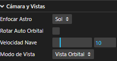
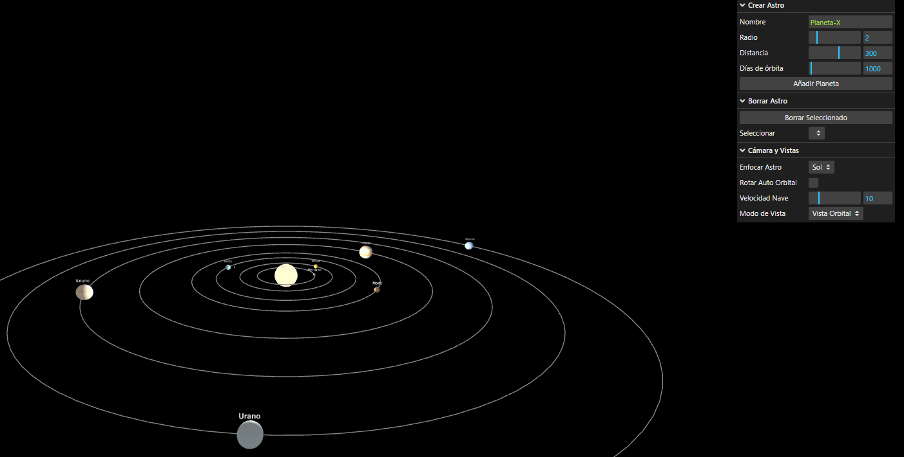
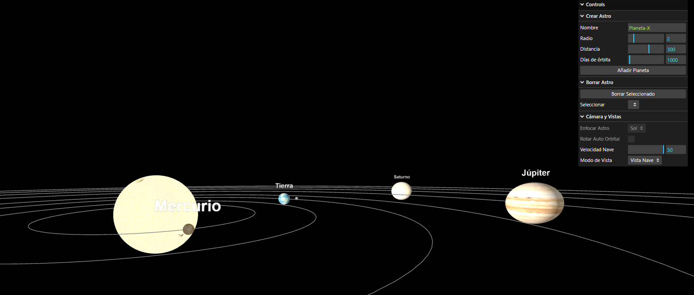
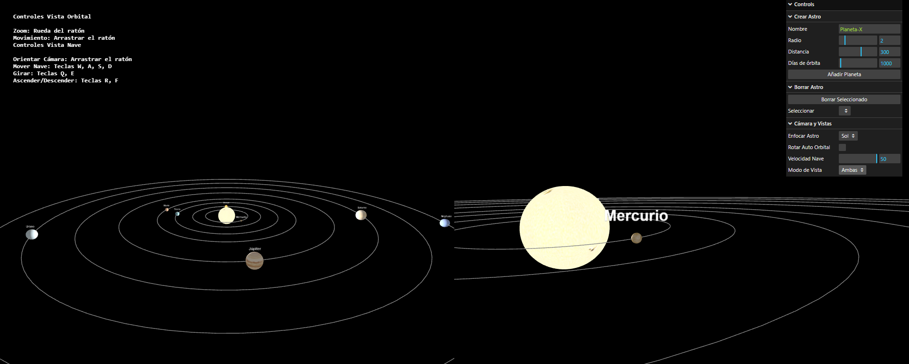
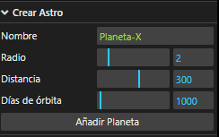
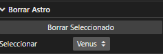

# Proyecto: Sistema Solar Interactivo

**Autor:** David Miranda Campos

## Descripción del Proyecto

Una simulación 3D interactiva de nuestro sistema solar, construida utilizando la biblioteca `three.js`. Este proyecto renderiza el Sol, los planetas principales y sus lunas, permitiendo al usuario explorar la escena desde diferentes perspectivas.

## Puesta en Marcha Local

Para ejecutar la simulación en su máquina local, siga estos pasos. Se asume que el proyecto está configurado para usar un bundler como Parcel (basado en los comandos del ejemplo).

1.  **Clonar el repositorio y entrar a este proyecto**

    ```bash
    git clone https://github.com/davidmrnd/IG-Lab
    cd sistema-solar-interactivo
    ```

2.  **Instalar Node.js:**
    Asegúrese de tener una versión reciente de [Node.js](https://nodejs.org/en) instalada. Puede verificar su instalación con:

    ```bash
    node --version
    npm --version
    ```

3.  **Instalar dependencias:**
    Abra un terminal en el directorio raíz del proyecto y ejecute:

    ```bash
    npm install
    ```

4.  **Iniciar el servidor:**
    Una vez termine la instalación, inicie el servidor de desarrollo local:

    ```bash
    npm run start
    ```

5.  **Abrir en el navegador:**
    La consola le indicará la dirección local donde se está ejecutando el servidor (generalmente `http://localhost:1234`). Abra esa URL en su navegador.

6.  Para detener la simulación, pulse `Ctrl + C` en el terminal.

## Guía de Interacción y Controles

La simulación se maneja a través de un panel de control y controles directos de cámara. En la esquina superior izquierda, un panel de texto le recordará los controles específicos para la vista que esté activa.

### 1\. Panel de Cámara y Vistas

Esta sección le permite gestionar la experiencia de visualización:

  * **Enfocar Astro:** Un menú desplegable para centrar la "Vista Orbital" en el Sol o en cualquier planeta existente.
  * **Rotar Auto Orbital:** Una casilla que activa una rotación lenta y constante de la cámara orbital alrededor del objeto enfocado.
  * **Velocidad Nave:** Un deslizador para ajustar qué tan rápido se mueve la cámara en la "Vista Nave".

    
  * **Modo de Vista:** Un selector clave para cambiar entre tres modos:
      * **Vista Orbital:** (Predeterminada) Le permite orbitar alrededor de un astro.
          * **Arrastrar ratón:** Rota la cámara.
          * **Rueda del ratón:** Acerca o aleja el zoom.

      * **Vista Nave:** Una cámara de vuelo libre (*FlyControls*).
          * **Arrastrar ratón:** Orienta la cámara.
          * **W, A, S, D:** Mover la nave (adelante, izq., atrás, der.).
          * **R, F:** Ascender y descender.
          * **Q, E:** Rotar/Alabear la nave.
  
      * **Ambas:** Muestra una vista de pantalla dividida, combinando la Vista Orbital (izquierda) y la Vista Nave (derecha).


### 2\. Gestión Dinámica de Astros

Una característica clave de esta simulación es la capacidad de modificar el sistema solar en tiempo real. El panel de control incluye dos carpetas dedicadas a la creación y eliminación de astros.

#### Crear Astro

Este panel le permite diseñar y añadir un nuevo planeta a la simulación. Los parámetros configurables son:

* **Nombre:** El nombre personalizado para su nuevo astro (ej. "Planeta-X").
* **Radio:** Define el tamaño del planeta.
* **Distancia:** Establece a qué distancia del Sol orbitará el nuevo planeta.
* **Días de órbita:** Controla la velocidad de traslación. Un número más alto (más días) resulta en una órbita más lenta.

Una vez configurado, pulse el botón **"Añadir Planeta"** para instanciarlo en la escena. El nuevo planeta se agregará automáticamente a los menús desplegables de "Enfocar Astro" y "Borrar Astro".



#### Borrar Astro

Este panel permite eliminar cualquier planeta de la simulación (excepto el Sol).

* **Seleccionar:** Use este menú desplegable para elegir el planeta que desea eliminar. El menú lista todos los planetas actualmente en la escena.
* **Borrar Seleccionado:** Al pulsar este botón, el planeta seleccionado se eliminará permanentemente de la simulación. Si la cámara estaba enfocando a ese astro, automáticamente volverá a enfocar al Sol.



